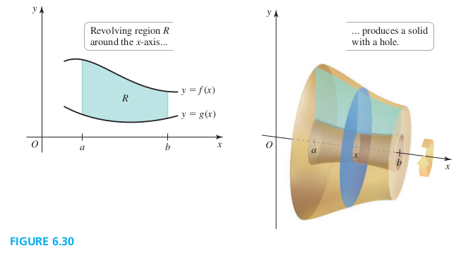
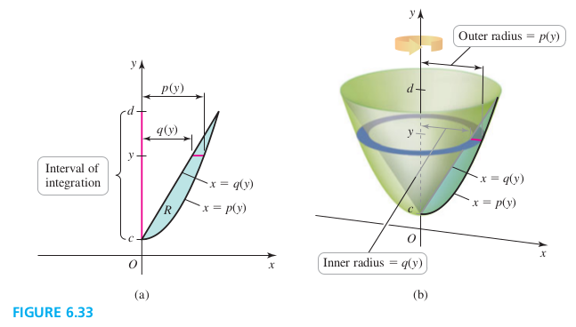

### Section 6.3 Volume By Slicing

#### General Slicing Method

$$
\begin{aligned}
V &= \lim_{n \to \infty} \sum_{k=1}^n A(x_k^{\ast}) \Delta x\\
&= \int_a^b A(x) dx
\end{aligned}
$$

#### Disk Method About the x-axis
Let _R_ be the region bounded by $y=f(x)$, the x-axis and the lines $x=a$ and $x=b$. When R is revolved about x-axis, the volume of the resulting solid of revolution is
$$
\begin{aligned}
V &= \int_a^b \pi f(x)^2 dx
\end{aligned}
$$

#### Washer Method About the x-axis

Let _R_ be the region bounded by $y=f(x), y=g(x)$, and the lines $x=a$ and $x=b$. When R is revolved about _x-axis_, the volume of the resulting solid of revolution is
$$
\begin{aligned}
V &= \int_a^b \pi (f(x)^2 - g(x)^2) dx
\end{aligned}
$$

#### Disk and Washer Method About the y-axis

$$
\begin{aligned}
V &= \int_c^d \pi (p(y)^2 - q(y)^2) dy
\end{aligned}
$$

#### Homework
p419: 1, 7, 8, 10, 12, 18, 19, 20, 25, 27, 29, 31, 34, 35, 36, **37, 39**, 43, 47, 49, 51, 54, 56, 61a (Show a diagram with a representative slice or rectangle and evaluate integrals completely)

1\. Suppose a cut is made through a solid object perpendicular to the x-axis at a particular point $x$. Explain the meaning of $A(x)$.
>Solution
$A(x)$ is the area of the cross section of the solid object at point $x$.

7–16\. **General slicing method** Use the general slicing method to find the volume of the following solids.
7\. The solid whose base is the region bounded by the curves $y = x^2$ and $y = 2 - x^2$ and whose cross sections through the solid perpendicular to the x-axis are squares.
>Solution
$x^2=2-x^2 \To x=\pm 1$. $y = x^2$ and $y = 2 - x^2$ intersect at points $x=\pm 1$.
$$
\begin{aligned}
A(x) &= [x^2 - (2-x^2)]^2 = 4x^4-8x^2+4\\
V_{Riemann Sum} &= \sum_{k=1}^n A(x_k)\Delta x = \sum_{k=1}^n (4x_k^4-8x_k^2+4)\Delta x\\
V &= \int_{-1}^1 A(x)dx\\
&= 8\int_0^1 (x^4-2x^2+1)dx\\
&= 8(\frac{1}{5}x^5 -\frac{2}{3}x^3 + x) \mid_0^1 = \frac{64}{15}
\end{aligned}
$$

8\. The solid whose base is the region bounded by the semicircle $y = \sqrt {1 - x^2}$ and the x-axis and whose cross sections through the solid perpendicular to the x-axis are squares.
>Solution
With the cross sections being **squares**
$$
\begin{aligned}
V_{square} &= \int_{-1}^1 (1-x^2)dx\\
&= 2(x-\frac{1}{3}x^3) \mid_0^1 = \frac{4}{3}
\end{aligned}
$$
With the cross sections being **semicircles**
$$
\begin{aligned}
V_{semicircle} &= \int_{-1}^1 \frac{\pi}{2}(\frac{\sqrt{1-x^2}}{2})^2dx\\
&= \pi(x-\frac{1}{3}x^3) \mid_0^1 = \frac{\pi}{6}
\end{aligned}
$$

10\. The solid with a circular base of radius 5 whose cross sections perpendicular to the base and parallel to the x-axis are equilateral triangles.
>Solution
$$
\begin{aligned}
A(y) &=\frac{\sqrt 3}{4} \lb\sqrt {25-y^2} - (-\sqrt {25-y^2})\rb ^2\\
&= \sqrt 3(25 -y^2)\\
V &= \int_{-5}^5 A(y)dy\\
&= 2\sqrt 3(25y - \frac{1}{3}y^3) \mid_0^5 = \frac{500}{3}\sqrt 3
\end{aligned}
$$

12\. The solid whose base is the region bounded by $y = x^2$ and the line $y = 1$ and whose cross sections perpendicular to the base and parallel to the x-axis are squares.
>Solution
$$
\begin{aligned}
A(y) &= (\sqrt y- (-\sqrt y))^2 = 4y\\
V_{Riemann Sum} &= \sum_{k=1}^n 4y_k \Delta y\\
V &= \int_0^1 A(y)dy\\
&= 2y^2 \mid_0^1 = 2
\end{aligned}
$$

17–26\. **Disk method** Let R be the region bounded by the following curves. Use the disk method to find the volume of the solid generated when R is revolved about the x-axis.
18\. $y=2-2x, y=0, x-0$ (Verify that your answer agrees with the volumn formula for a cone). Graph (18).
>Solution
The cone would have a base of radius $2$ and height of $1$.
$$
\begin{aligned}
V_{cone} &= \frac{1}{3}\pi r^2 h = \frac{4}{3}\pi\\
V_{integration} &= \int_0^1 \pi (2-2x)^2dx \\
&= 4\pi(\frac{1}{3}x^3 - x^2 + x) \mid_0^1\\
&= \frac{4}{3}\pi = V_{cone}\\
\end{aligned}
$$

19\. $y=e^{-x}, y=0, x=0, x=\ln 4$. Graph (19).
>Solution
$$
\begin{aligned}
V &= \int_0^{\ln 4} \pi (e^{-x})^2 dx\\
&= -\frac{1}{2} \pi (e^{-2x}) \mid_0^{\ln 4}\\
&= -\frac{1}{2} \pi (\frac{1}{(e^{\ln 4})^2} - \frac{1}{e^{0}}) = \frac{15\pi}{32}
\end{aligned}
$$

20\. $y=\cos x, y=0, x=0, x=\dfrac{\pi}{2}$. Graph (20).
>Solution
$$
\begin{aligned}
V &= \int_0^{\frac{\pi}{2}} \pi (\cos x)^2 dx\\
&= \frac{1}{2} \pi \int_0^{\frac{\pi}{2}} (1 + \cos 2x) dx\\
&= \frac{1}{2} \pi (x + \frac{1}{2} \sin 2x) \mid_0^{\frac{\pi}{2}}\\
&= \frac{1}{2} \pi (\frac{1}{2} \pi + \frac{1}{2} \sin \pi - 0-0) = \frac{\pi^2}{4}
\end{aligned}
$$

25\. $y=\dfrac{1}{\sqrt{1+x^2}}, y=0, x=-1, x=1$. Graph (25).
>Solution
$$
\begin{aligned}
V &= \int_{-1}^1 \pi (\frac{1}{\sqrt{1+x^2}})^2 dx\\
&= 2\pi (\arctan x) \mid_0^1 = \frac{\pi^2}{2}
\end{aligned}
$$

27–34\. **Washer method** Let R be the region bounded by the following curves. Use the washer method to find the volume of the solid generated when R is revolved about the x-axis.
27\. $y=x, y=2\sqrt x$. Graph (27).
>Solution
$$
\begin{aligned}
V &= \int_0^4 \pi \lb (2\sqrt x)^2-x^2 \rb dx\\
&=\pi (2x^2-\frac{1}{3} x^3)\mid_0^4 = \frac{32\pi}{3}
\end{aligned}
$$

29\. $y=e^{x/2}, y=e^{-x/2}, x=\ln 2, x=\ln 3$. Graph (29).
>Solution
$$
\begin{aligned}
V &= \int_{\ln 2}^{\ln 3} \pi \lb (e^{x/2})^2-(e^{-x/2})^2 \rb dx\\
&= \pi \int_{\ln 2}^{\ln 3} (e^x - e^{-x})dx\\
&= \pi (e^x+e^{-x}) \mid_{\ln 2}^{\ln 3} = \frac{5\pi}{6}
\end{aligned}
$$

31\. $y=x+3, y=x^2+1$. Graph (31).
>Solution
$y=x+3$ and $y=x^2+1$ intersect at points $x=-1, 2$
$$
\begin{aligned}
V &= \int_{-1}^2 \pi \lb (x+3)^2 - (x^2+1)^2 \rb dx\\
&= \pi \int_{-1}^2 (-x^4-x^2+6x+8)dx\\
&= \pi (-\frac{1}{5} x^5 - \frac{1}{3} x^3 + 3x^2 + 8x) \mid_{-1}^2 = \frac{117\pi}{5}
\end{aligned}
$$

34\. $y= |x|, y=2-x^2$. Graph (34).
>Solution
$y= |x|$ and $y=2-x^2$ intersect at points $x=-1, 1$.
$$
\begin{aligned}
V &= \int_{-1}^1 \pi \lb (2-x^2)^2-|x|^2 \rb dx\\
&= \pi \int_{-1}^1 (x^4-5x^2+4)dx\\
&= \pi (\frac{1}{5}x^5 - \frac{5}{3} x^3 + 4x)\mid_{-1}^1 = \frac{76\pi}{15}
\end{aligned}
$$

35–40\. **Disks, washers about the y-axis** Let R be the region bounded by the following curves. Use the disk or washer method to find the volume of the solid generated when R is revolved about the y-axis.
35\. $y=x, y=2x, y=6$. Graph (35).
>Solution
$x=y, x=\frac{1}{2} y$
$$
\begin{aligned}
V & = \int_0^6 \pi (y^2 - (\frac{1}{2}y)^2) dy\\
&= \frac{3}{4} \pi \int_0^6 y^2 dy\\
&= \frac{3}{4} \pi (\frac{1}{3} y^3) \mid_0^6 = 54 \pi
\end{aligned}
$$

36\. $y=0, y=\ln x, y=2$. Graph (36).
>Solution
$x= e^y$
$$
\begin{aligned}
V &= \int_0^2 \pi (e^y)^2 dy\\
&= \frac{\pi}{2} e^{2y} \mid_0^2 = \frac{\pi}{2}(e^4-1)
\end{aligned}
$$

37\. $y=x^3, y=0, x=2$. Graph (37).
>Solution
$x=\sqrt[3] y$
$$
\begin{aligned}
V &= \int_0^8 \pi (2^2 - (\sqrt[3] y)^2) dy\\
&= \pi (4 - \frac{3}{5} y^{\frac{5}{3}})\mid_0^8 = \frac{64\pi}{5}
\end{aligned}
$$

39\. $x=\sqrt{4-y^2}, x=0$. Graph (39).
>Solution
$$
\begin{aligned}
V &= \int_{-2}^2 \pi (\sqrt {4-y^2})^2 dy\\
&= \pi (4y-\frac{1}{3}y^3)\mid_{-2}^2 = \frac{16\pi}{3}
\end{aligned}
$$

41–44\. Which is greater? For the following regions R, determine which is greater—the volume of the solid generated when R is revolved about the x-axis or about the y-axis.
43\. $R$ is bounded by $y=1-x^3$, the x-axis and the y-axis. Graph (43).
>Solution
$y=1-x^3 \To x=\sqrt[3] {1-y}$
$$
\begin{aligned}
V_{x-axis} &= \int_0^1 \pi (1-x^3)^2 dx  &\text{revolved about x-axis}\\
&= \pi (\frac{1}{7} x^7 - \frac{1}{2} x^4 + x)\mid_0^1 = \frac{9\pi}{14}\\
V_{y-axis} &= \int_0^1 \pi (\sqrt[3] {1-y})^2 dy  &\text{revolved about y-axis}\\
&= -\frac{3\pi}{5}(1-y)^{\frac{5}{3}} \mid_0^1 = \frac{3\pi}{5}\\
V_{x-axis} &\gt V_{y-axis}
\end{aligned}
$$

46–52\. **Solids of revolution** Find the volume of the solid of revolution. Sketch the region in question.
47\. The region bounded by $y=\frac{1}{\sqrt x}, y=0, x=2$ and $x=6$ revoled about x-axis. Graph (47).
>Solution
$$
\begin{aligned}
V &= \int_2^6 \pi (\frac{1}{\sqrt x})^2 dx\\
&= \pi (\ln x) \mid_2^6 = \pi \ln3
\end{aligned}
$$

49\. The region bounded by $y=e^x, y=0, x=0$ and $x=2$ revoled about x-axis. Graph (49).
>Solution
$$
\begin{aligned}
V &= \int_0^2 \pi (e^x)^2 dx\\
&= \frac{\pi}{2} e^{2x} \mid_0^2 = \frac{\pi}{2}(e^4-1)
\end{aligned}
$$

51\. The region bounded by $y=\ln x, y=\ln x^2$ and $y=\ln 8$ revoled about y-axis. Graph (51).
>Solution
$$
\begin{aligned}
y &= \ln x \To x=e^y\\
y &= \ln x^2 \To x=e^{\frac{y}{2}}\\
V &= \int_0^{\ln 8} \pi \lb (e^y)^2 - (e^{\frac{y}{2}})^2 \rb dy\\
&= \pi(\frac{e^{2y}}{2} - e^y) \mid_0^{\ln 8} = \frac{49\pi}{2}
\end{aligned}
$$

54\. **Solid from a piecewise function** Let $f(x)=\begin{cases}
x & \text{if } 0 \les x \les 2\\
2x-2 & \text{if } 2 \lt x \les 5\\
-2x+18 & \text{if } 5 \lt x \les 6
\end{cases}$
Find the volume of the solid formed when the region bounded by the graph of $f$, the x-axis, and the line $x = 6$ is revolved about the x-axis. Graph (54).
>Solution
$$
\begin{aligned}
V &= \int_0^2 \pi x^2 dx + \int_2^5 \pi (2x-2)^2 dx + \int_5^6 \pi (-2x+18)^2 dx\\
&= \frac{\pi}{3}x^3\mid_0^2 + 4\pi(\frac{1}{3}x^3-x^2 + x)\mid_2^5 + 4\pi(\frac{1}{3}x^3-9x^2 + 81x)\mid_5^6 \\
&= \frac{8\pi}{3} + 84\pi + \frac{148\pi}{3} = 136\pi
\end{aligned}
$$

56\. **Volume of a wooden object** A solid wooden object turned on a lathe has a length of $50 cm$ and diameters (measured in cm) shown in the figure. (A lathe is a tool that spins and cuts a block of wood so that it has circular cross sections.) Use left Riemann sums to estimate the volume of the object.
>Solution
$$
\begin{aligned}
V &= \sum_{k=1}^{n=6}A(x_k) \Delta x\\
A(x_k) &= \pi r^2, \Delta x = \frac{50}{6}\\
V &= \frac{50\pi}{6}(\frac{12.6^2}{4} + \frac{14.0^2}{4} + \frac{16.8^2}{4} + \frac{25.2^2}{4} + \frac{36.4^2}{4} + \frac{42.0^2}{4})\\
&\approx 28542.7 cm^3
\end{aligned}
$$

61\. **Cavalieri's principle** Cavalieri's principle states that if two solids of equal altitudes have the same cross-sectional areas at every height, then they have equal volumes (see figure).
a. Use the theory of this section to justify Cavalieri's principle.
>Solution
By the slicing method, $V = \dint_a^b A(x)dx$, Because the two solid have the same cross-sectional areas ($A(x)$) at every height ($x$), they must have the same volume ($V$).
