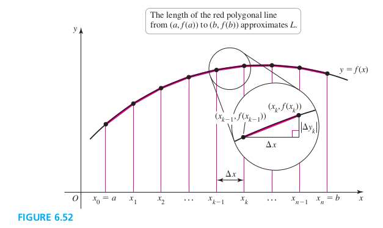

### Section 6.5 Length of Curves

$$
\begin{aligned}
L &\approx \sum_{k=1}^n \sqrt{(\Delta x)^ + (\Delta y_k)^2}\\
&= \sum_{k=1}^n \sqrt{(\Delta x)^2 \lb 1 + (\frac{\Delta y_k}{\Delta x})^2 \rb}\\
&= \sum_{k=1}^n \sqrt{1 + (\frac{\Delta y_k}{\Delta x})^2} \Delta x\\
&= \sum_{k=1}^n \sqrt{1 + f'(x_k^{\ast})^2} \Delta x
\end{aligned}
$$
As n increases and as $\Delta x$ approaches zero, the sum approaches a defined integral, which is also the exact length of the curve. We have
$$
\begin{aligned}
L &= \lim_{n \to \infty} \sum_{k=1}^n \sqrt{1 + f'(x_k^{\ast})^2} \Delta x\\
&= \int_a^b \sqrt{1 + f'(x)^2} dx
\end{aligned}
$$

#### Homework
p440: 3, 5, 7, 13, 17, 25bc, 27, 28, 29, 31 (Integrate the few that can be done completely and then use Wolfram Alpha or your calculator or other to get approximations on the others.)

3–10\. **Arc length calculations** Find the arc length of the following curves on the given interval by integrating with respect to $x$.
3\. $y=2x+1; [1, 5]$
>Solution
$$
\begin{aligned}
L &= \int_1^5 \sqrt{1 + (y')^2} dx\\
&= \int_1^5 \sqrt{1 + 2^2} dx = 4\sqrt 5
\end{aligned}
$$

5\. $y=\frac{1}{3} x^{3/2}; [0, 60]$
>Solution
$$
\begin{aligned}
L &= \int_0^{60} \sqrt{1 + (y')^2} dx\\
&= \int_0^{60} \sqrt{1 + (\frac{1}{2} x^{1/2})^2} dx\\
&= \frac{1}{2} \int_0^{60} (\sqrt{x+4})dx \\
&= \frac{1}{3} (x+4)^{\frac{3}{2}} \mid_0^{60} = 168
\end{aligned}
$$

7\. $y=\dfrac{(x^2+2)^{3/2}}{3}; [0, 1]$
>Solution
$$
\begin{aligned}
L &= \int_0^1 \sqrt{1 + (y')^2} dx\\
&= \int_0^1 \sqrt{1 + (x\sqrt{x^2+2})^2} dx\\
&= \int_0^1 (x^2+1) dx\\
&= (\frac{1}{3} x^3 + x)\mid_0^1 = \frac{4}{3}
\end{aligned}
$$

<!-- pagebreak -->
11-20\. **Arc length by calculator**
a. Write and simplify the integral that gives the arc length of the following curves on the given interval.
b. If necessary, use technology to evaluate or approximate the integral.
13\. $y=\ln x; [1, 4]$
>Solution
$$
\begin{aligned}
L &= \int_1^4 \sqrt{1 + (y')^2} dx\\
&= \int_1^4 \sqrt{1 + \frac{1}{x^2}} dx \approx 3.34
\end{aligned}
$$

17\. $y=\cos 2x; [0, \pi]$
>Solution
$$
\begin{aligned}
L &= \int_0^{\pi} \sqrt{1 + (y')^2} dx\\
&= \int_0^{\pi} \sqrt{1 + (-2\sin 2x)^2} dx \approx 5.27
\end{aligned}
$$

25\. **Explain why or why not** Determine whether the following statements are true and give an explanation or counterexample.
b. Assuming $f'$is continuous on the interval $[a,b]$, the length of the curve $y=f(x)$ on $[a,b]$ is the area under the curve $y=\sqrt{1+f'(x^2)}$ on $[a, b]$.
>Solution
True. They both can be given by $\dint_a^b \sqrt{1+f'(x)^2}dx$.

c. Arc length may be negative if $f(x) < 0$ on part of the interval in question.
>Solution
False. Because $\sqrt{1+f'(x)^2} > 0$

27\. **Functions from arc length** What differentiable functions have an arc length on the interval $[a, b]$ given by the following integrals? Note that the answers are not unique. Give a family of functions that satisfy the conditions.
a. $\dint_a^b \sqrt{1+16x^4} dx$ &emsp; b. $\dint_a^b \sqrt{1+36\cos^2 (2x)} dx$
>Solution
a. $f(x) = \pm \dfrac{4}{3}x^3 + C$ &emsp; b. $f(x) = \pm 3\sin 2x + C$

<!-- pagebreak -->
28\. **Function from arc length** What curve passes through the point $(1, 5)$ and has an arc length on the interval $[2, 6]$ given by $\dint_2^6 \sqrt{1+16x^{-6}}dx$.
>Solution
$f'(x) = \pm 4x^{-3} \To f(x) = \pm \dfrac{2}{x^2} + C$. Solve for $C$.
$$
\begin{aligned}
\dfrac{2}{1^2} + C = 5 \To C = 3\\
-\dfrac{2}{1^2} + C = 5 \To C = 7\\
f(x) = \dfrac{2}{x^2} + 3, -\dfrac{2}{x^2} + 7
\end{aligned}
$$

29\. **Cosine vs. parabola** Which curve has the greater length on the interval $[-1, 1], y=1-x^2$ or $y=\cos(\pi x/2)$?
>Solution
Let $f(x) = 1-x^2, f'(x)=-2x$, and $g(x) = \cos (\dfrac{\pi x}{2}), g'(x) = -\dfrac{\pi}{2} \sin (\dfrac{\pi x}{2})$.
$$
\begin{aligned}
L_{parabola} &= \int_{-1}^1 \sqrt{1+(-2x)^2} dx \approx 2.96\\
L_{cos} &= \int_{-1}^1 \sqrt{1+(-\dfrac{\pi}{2} \sin (\dfrac{\pi x}{2}))^2} dx \approx 2.92\\
L_{parabola} &> L_{cos}
\end{aligned}
$$

31\. **Golden Gate cables** The profile of the cables on a suspension bridge may be modeled by a parabola. The central span of the Golden Gate Bridge (see figure) is $1280m$ long and $152m$ high. The parabola $y = 0.00037x^2$ gives a good fit to the shape of the cables, where $|x| \les 640$, and $x$ and $y$ are measured in meters. Approximate the length of the cables that stretch between the tops of the two towers.
>Solution
$L = \int_{-640}^{640} \sqrt{1 + (0.00074x)^2} dx \approx 1326.4$
